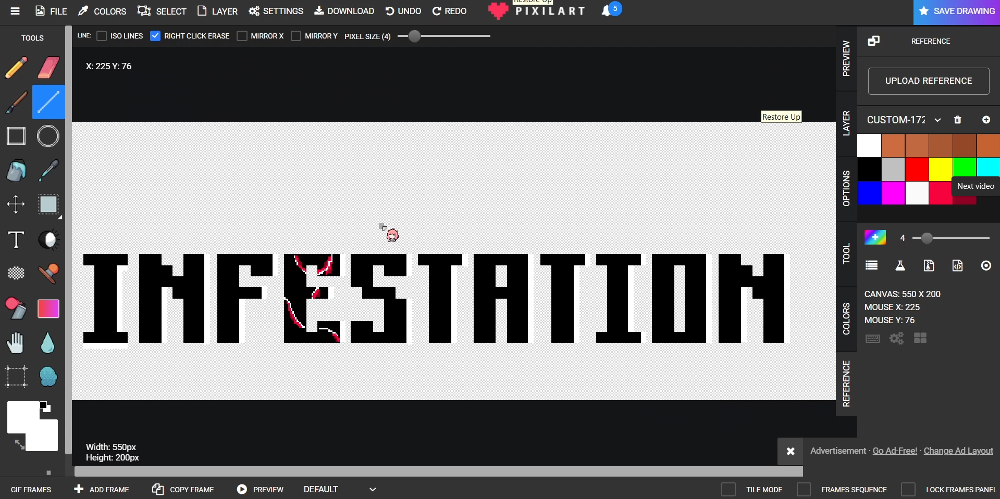
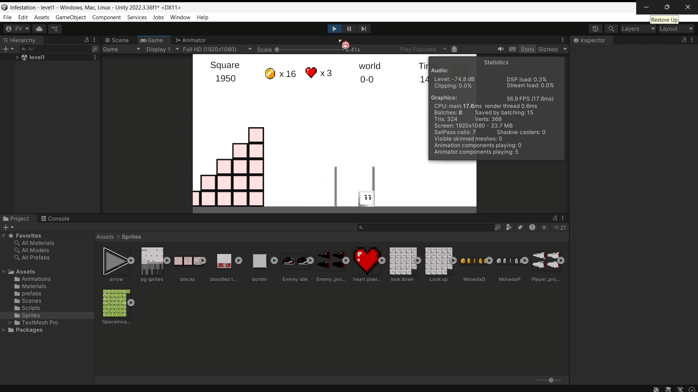
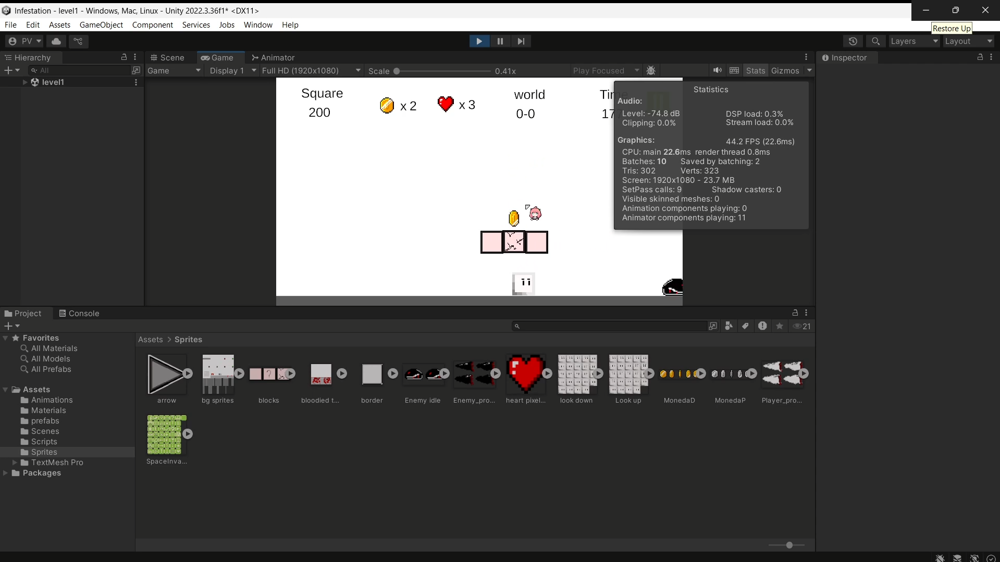
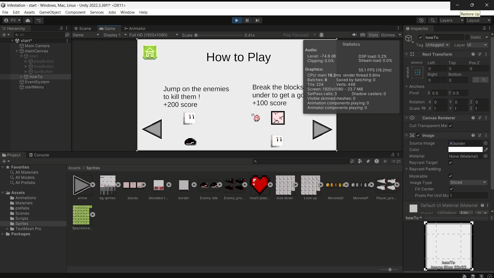
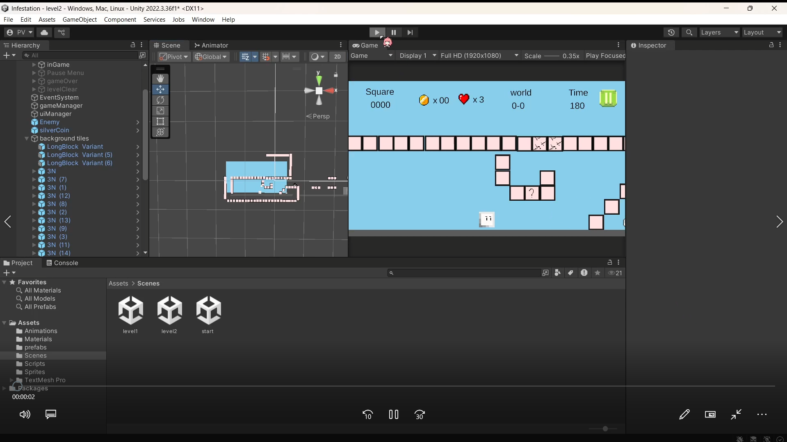
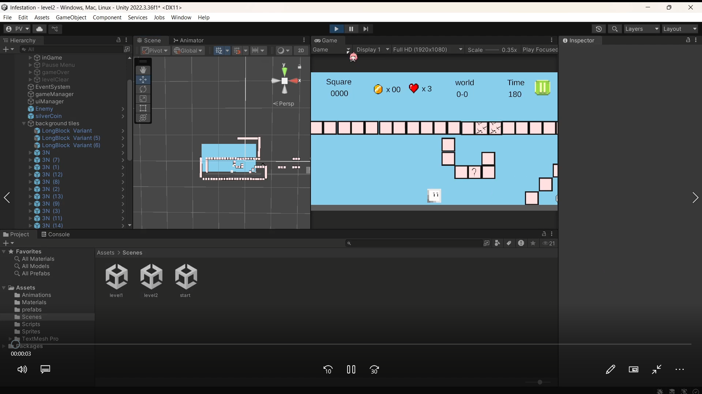
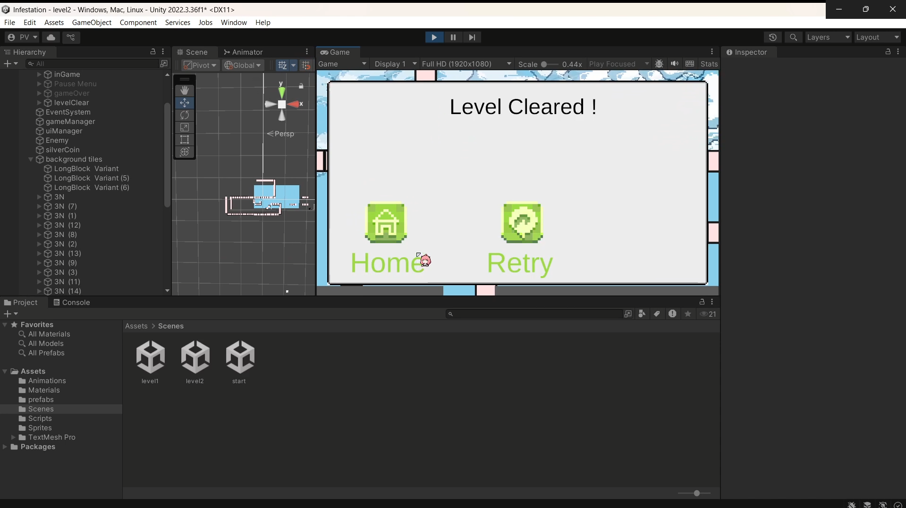

# Nintendo please dont sue me >_<

I made this mario like on my own, without the help of a tutorial, as a game it might be very much a buggy mess. 
But for what i did i am pretty proud, this was also when i realised when i show this to my friends it behaves differently from what i see.
That was probably because my physics was botched up and everything was so hard to manage that i had a real back breaking experience with this one.
This was also when i relaized i could tile sprites instead of copy and pasting the same gameObject a 100 times. Sad thing was i got to know that 
after i finished the game. So yea   /(ㄒoㄒ)/~~

<h4>Things i learnt</h4>
<ul>
  <li>Managing different physics based events</li>
  <li>Handling movement in 2d</li>
  <li>Working with tiled sprites ( •̀ ω •́ )✧</li>
</ul>

<h4>Here are the project images</h4>

  
  
  
  
  
  

